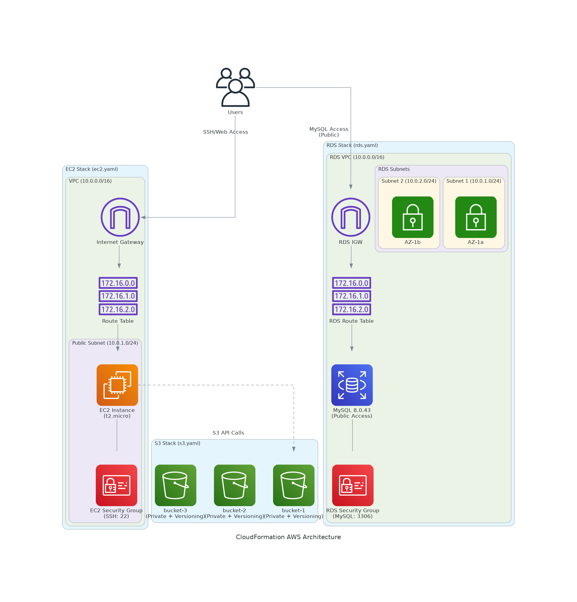

# CloudFormation Deployment Guide

This folder contains 3 CloudFormation templates for AWS infrastructure deployment.

## Architecture Diagram



## Files
- `s3.yaml` - Creates 3 private S3 buckets with versioning
- `ec2.yaml` - Creates VPC, subnet, security group, and EC2 instance with public IP
- `rds.yaml` - Creates MySQL RDS database with public access

## Prerequisites
- AWS CLI configured with credentials
- EC2 Key Pair created in your AWS account
- Sufficient IAM permissions

## Deployment Commands

### 1. Deploy S3 Buckets
```bash
aws cloudformation create-stack --stack-name nm1811-s3-stack --template-body file://s3.yaml --parameters ParameterKey=ProjectName,ParameterValue=nm1811-cloudformation ParameterKey=Environment,ParameterValue=dev --region us-east-1

```

### 2. Deploy EC2 Infrastructure
```bash
aws cloudformation create-stack --stack-name nm1811-ec2-stack --template-body file://ec2.yaml --parameters ParameterKey=ProjectName,ParameterValue=nm1811-cloudformation ParameterKey=Environment,ParameterValue=dev ParameterKey=InstanceType,ParameterValue=t2.micro ParameterKey=KeyPairName,ParameterValue=nmkey --region us-east-1

```

### 3. Deploy RDS Database
```bash
aws cloudformation create-stack --stack-name nm1811-rds-stack --template-body file://rds.yaml --parameters ParameterKey=ProjectName,ParameterValue=nm1811-cloudformation ParameterKey=Environment,ParameterValue=dev ParameterKey=DBInstanceClass,ParameterValue=db.t3.micro ParameterKey=DBName,ParameterValue=myappdb ParameterKey=DBUsername,ParameterValue=admin ParameterKey=DBPassword,ParameterValue=MySecurePassword123 --region us-east-1
```

## Check Stack Status
```bash
aws cloudformation describe-stacks --stack-name nm1811-s3-stack --region us-east-1
aws cloudformation describe-stacks --stack-name nm1811-ec2-stack --region us-east-1
aws cloudformation describe-stacks --stack-name nm1811-rds-stack --region us-east-1
```

## Get Stack Outputs
```bash
aws cloudformation describe-stacks --stack-name nm1811-ec2-stack --query 'Stacks[0].Outputs' --region us-east-1
aws cloudformation describe-stacks --stack-name nm1811-rds-stack --query 'Stacks[0].Outputs' --region us-east-1
```

## Delete Stacks
```bash
aws cloudformation delete-stack --stack-name nm1811-rds-stack --region us-east-1
aws cloudformation delete-stack --stack-name nm1811-ec2-stack --region us-east-1
aws cloudformation delete-stack --stack-name nm1811-s3-stack --region us-east-1
```

## Template Details

### S3 Template
- Creates 3 private S3 buckets
- Enables versioning on all buckets
- Blocks public access

### EC2 Template
- Creates VPC with public subnet
- Deploys EC2 instance with public IP
- Sets up Internet Gateway and Route Tables
- Configures security group for SSH access

### RDS Template
- Creates MySQL 8.0 database
- Enables public access (for demo purposes)
- Configures security group for MySQL port 3306
- Sets up multi-AZ subnet group
