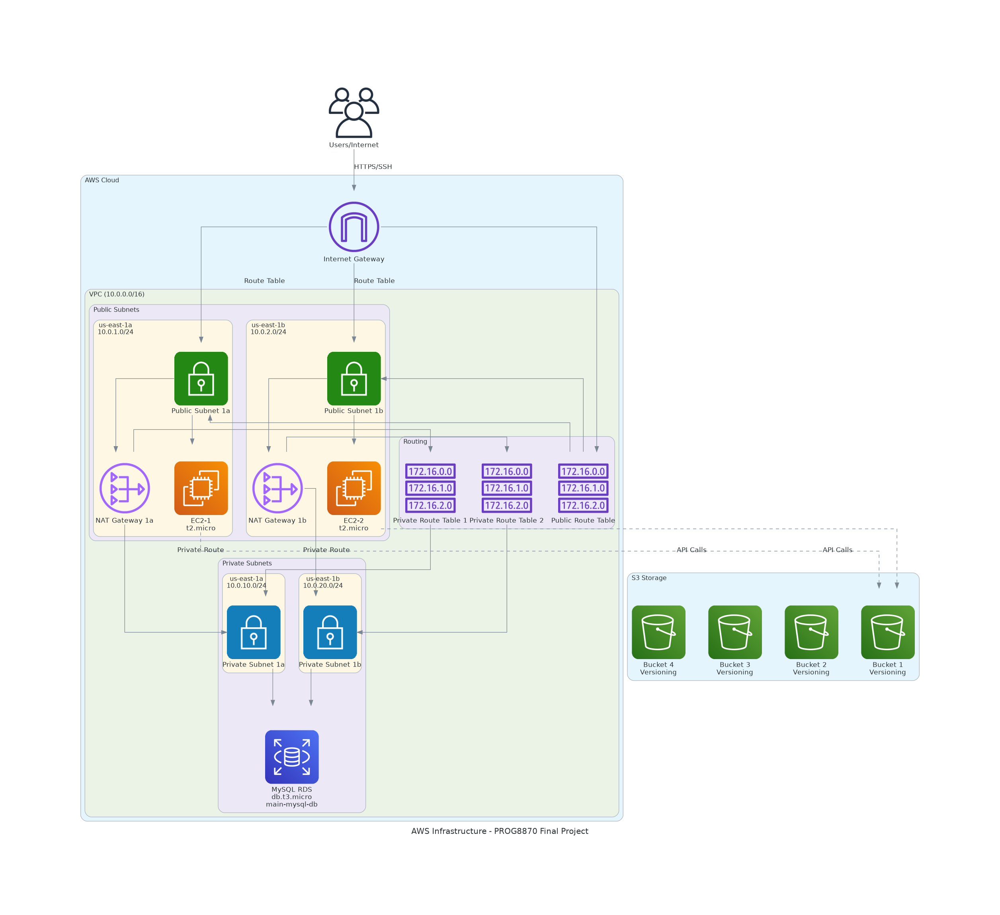
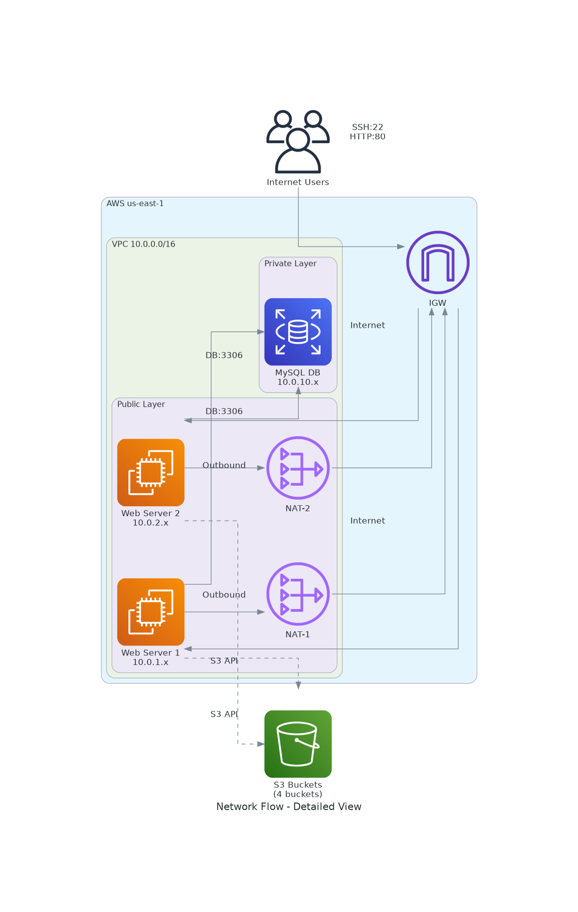
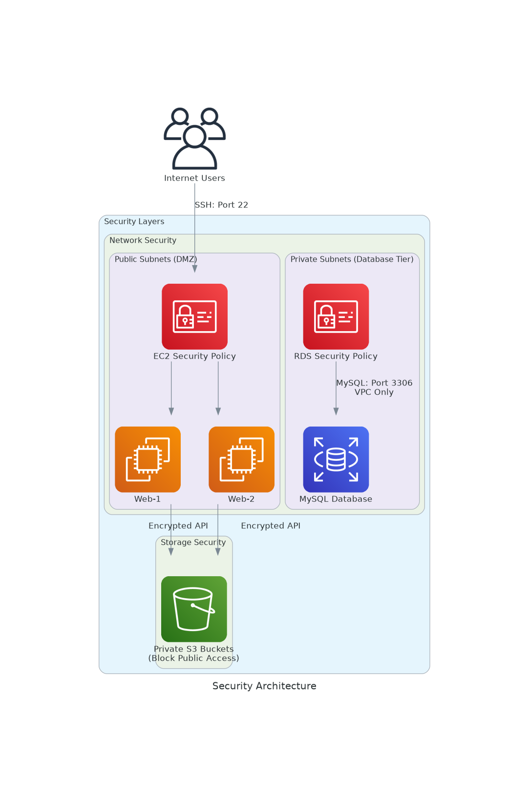

# AWS Infrastructure as Code (IaC) - Terraform Project

[](https://terraform.io)
[](https://aws.amazon.com)
[](LICENSE)

## 📋 Project Overview

This project demonstrates **Infrastructure as Code (IaC)** principles using Terraform to deploy a scalable, secure, and highly available AWS infrastructure. The architecture follows AWS Well-Architected Framework best practices and is designed for a production-ready environment.

**Course:** PROG8870 - Final Project  
**Author:** Nidhun Murali  
**Institution:** Conestoga College  

## 🏗️ Architecture Overview



The infrastructure consists of a multi-tier architecture with the following components:

### 🌐 Network Architecture


- **VPC**: Custom Virtual Private Cloud (10.0.0.0/16)
- **Multi-AZ Deployment**: Resources distributed across `us-east-1a` and `us-east-1b`
- **Public Subnets**: For internet-facing resources (10.0.1.0/24, 10.0.2.0/24)
- **Private Subnets**: For database resources (10.0.10.0/24, 10.0.20.0/24)
- **Internet Gateway**: Provides internet access to public subnets
- **NAT Gateways**: Enable outbound internet access for private subnets

### 🔒 Security Architecture


- **Security Groups**: Network-level firewall rules
- **Private S3 Buckets**: All public access blocked
- **Database Isolation**: RDS instances in private subnets only
- **Principle of Least Privilege**: Minimal required access permissions

## 🚀 Infrastructure Components

### Compute Layer
- **2x EC2 Instances** (t2.micro)
  - Amazon Linux 2
  - Deployed in public subnets
  - Auto-assigned public IPs
  - SSH access via key pair

### Database Layer
- **MySQL RDS Instance** (db.t3.micro)
  - MySQL 8.0 engine
  - 20GB allocated storage
  - Multi-AZ subnet group
  - Private subnet deployment
  - Automated backups enabled

### Storage Layer
- **4x S3 Buckets**
  - Versioning enabled
  - Public access blocked
  - Private bucket policies
  - Lifecycle management

### Network Layer
- **VPC with CIDR 10.0.0.0/16**
- **2x Public Subnets** (Multi-AZ)
- **2x Private Subnets** (Multi-AZ)
- **2x NAT Gateways** (High Availability)
- **1x Internet Gateway**
- **3x Route Tables** (1 Public, 2 Private)

## 📁 Project Structure

```
├── terraform/
│   ├── main.tf                 # Main Terraform configuration
│   ├── variables.tf            # Input variables definition
│   ├── outputs.tf              # Output values
│   ├── terraform.tfvars        # Variable values
│   ├── backend.tf              # Terraform state configuration
│   └── modules/
│       ├── vpc/                # VPC module
│       │   ├── main.tf
│       │   ├── variables.tf
│       │   └── outputs.tf
│       ├── ec2/                # EC2 module
│       │   ├── main.tf
│       │   ├── variables.tf
│       │   └── outputs.tf
│       ├── rds/                # RDS module
│       │   ├── main.tf
│       │   ├── variables.tf
│       │   └── outputs.tf
│       └── s3/                 # S3 module
│           ├── main.tf
│           ├── variables.tf
│           └── outputs.tf
├── .github/
│   └── workflows/
│       └── terraform-deploy.yml # CI/CD pipeline
└── README.md
```

## 🛠️ Prerequisites

- [Terraform](https://terraform.io/downloads.html) v1.6+
- [AWS CLI](https://aws.amazon.com/cli/) v2.0+
- AWS Account with appropriate permissions
- AWS key pair for EC2 access

## ⚡ Quick Start

### 1. Clone the Repository
```bash
git clone <repository-url>
cd terraform
```

### 2. Configure AWS Credentials
```bash
# Option 1: AWS Configure
aws configure

# Option 2: Environment Variables
export AWS_ACCESS_KEY_ID=your_access_key
export AWS_SECRET_ACCESS_KEY=your_secret_key
export AWS_SESSION_TOKEN=your_session_token  # If using temporary credentials
export AWS_DEFAULT_REGION=us-east-1
```

### 3. Update Configuration
Edit `terraform/terraform.tfvars`:
```hcl
# Update these values according to your requirements
key_pair_name = "your-key-pair-name"  # Add your AWS key pair name
db_password   = "YourSecurePassword"  # Change the database password
```

### 4. Deploy Infrastructure
```bash
cd terraform

# Initialize Terraform
terraform init

# Review the deployment plan
terraform plan

# Apply the configuration
terraform apply -auto-approve
```

### 5. Access Your Infrastructure
After successful deployment, Terraform will output:
- EC2 instance IDs and public IPs
- RDS endpoint
- S3 bucket names
- VPC and subnet IDs

## 🔧 Configuration Options

### Key Variables in `terraform.tfvars`:

| Variable | Description | Default |
|----------|-------------|---------|
| `aws_region` | AWS deployment region | `us-east-1` |
| `environment` | Environment name | `main` |
| `instance_type` | EC2 instance type | `t2.micro` |
| `db_instance_class` | RDS instance class | `db.t3.micro` |
| `vpc_cidr` | VPC CIDR block | `10.0.0.0/16` |
| `key_pair_name` | AWS key pair for EC2 access | `""` (must be set) |
